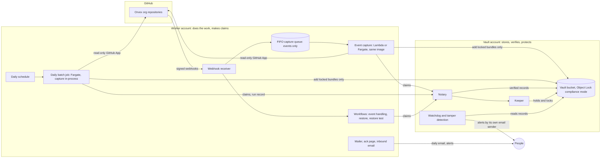
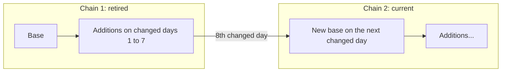
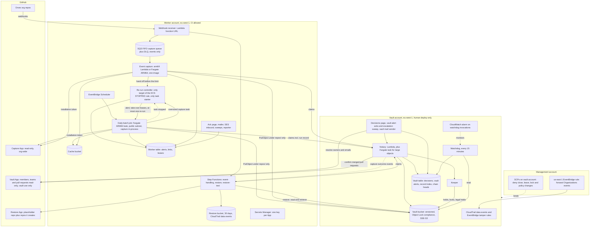
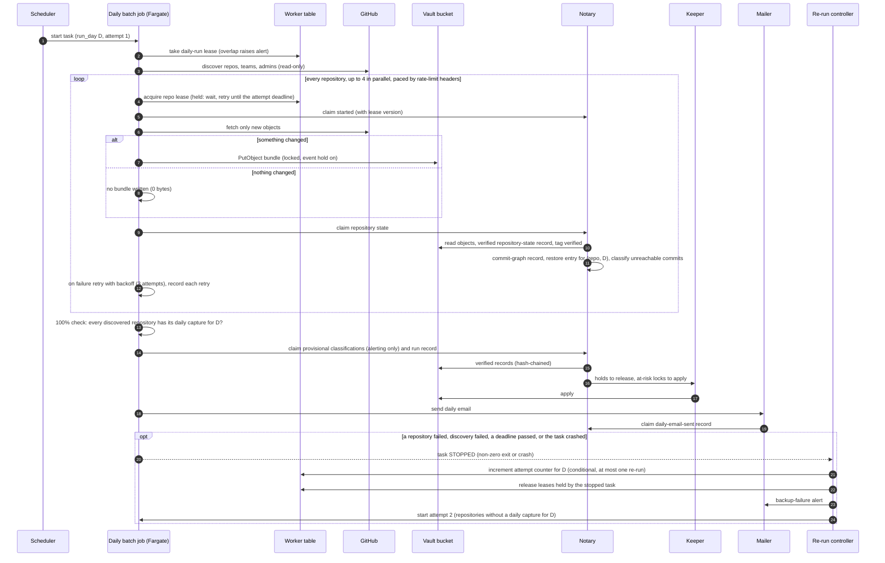
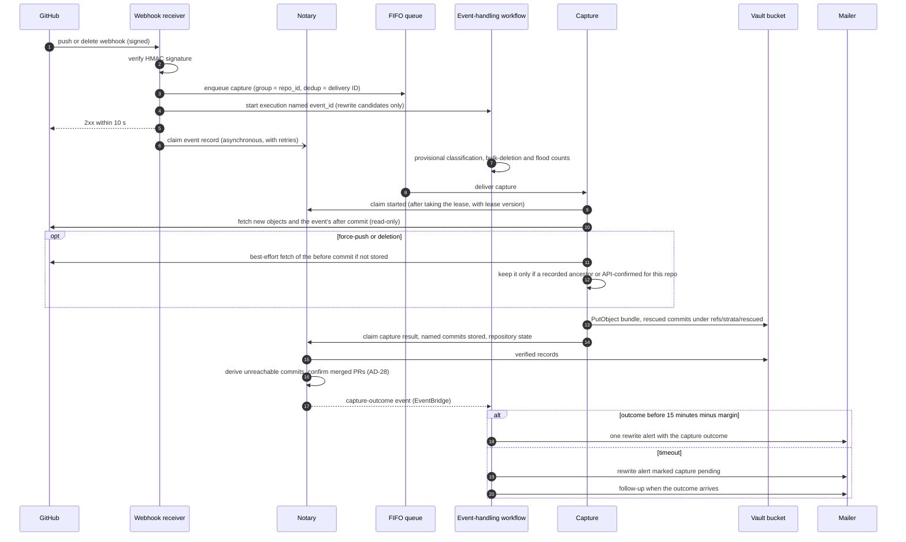
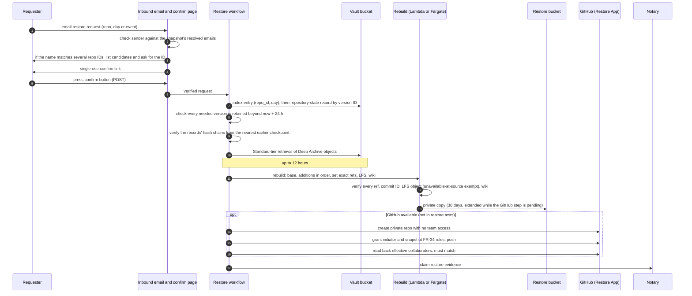
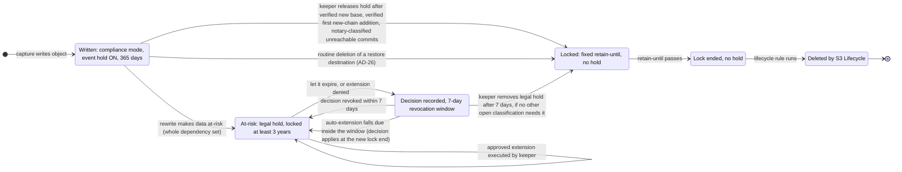

# Strata architecture

This document explains how Strata works and why it is built this way. It is written for the engineers and coding agents who will build Strata, and for the people who review the design.

**How this document relates to the others.** The binding rules are in `ARCHITECTURE-SPINE.md`, as decisions AD-1 to AD-29. AD-21 and AD-24 began as review fixes and were adopted by the product owner on 2026-10-07; all 29 decisions are [ADOPTED]. This document does not replace them. It explains them, shows them in diagrams, and records the alternatives and trade-offs. If the two ever disagree, the spine wins. Diagrams that appear in both documents (deployment, daily run, restore) are drawn from the spine's copies, which are the source. The reasons behind each decision come from the decision log (`.memlog.md`). Prices and service limits come from the research digest (`research-aws-github.md`, checked 2026-10-05) and the review in `reviews/review-verify-current.md` (checked 2026-10-06). Requirement IDs (FR-, NFR-, COST-) refer to the [PRD](PRD.md).

Decisions marked "product owner" were made by Maram, the product owner, as recorded in the decision log. Claude proposed options and did research.

**Contents**

1. [Summary](#1-summary)
2. [Answers to the assignment's questions](#2-answers-to-the-assignments-questions)
3. [Component walkthrough](#3-component-walkthrough)
4. [Decision record](#4-decision-record)
5. [Failure modes and how each is made loud](#5-failure-modes-and-how-each-is-made-loud)
6. [Residual risks, build gates and open questions](#6-residual-risks-build-gates-and-open-questions)
7. [Glossary](#7-glossary)

---

## 1. Summary

Strata backs up every repository in Orvex AI's GitHub org to AWS, once a day and again after every push.

- **Two accounts.** The **worker account** does the work and can only add objects and make claims. The **vault account** holds the backups and is the only place where trust lives: a **notary** checks every claim before it writes a record, a **keeper** is the only thing that changes locks, and **S3 Lifecycle** is the only thing that deletes.
- **Daily run.** One scheduled Fargate batch job captures every repository. If it fails, a **re-run controller** starts it at most once more that day.
- **Push captures.** A queue and Lambda capture a single repository after each push, with the same capture code. Restores, restore tests and live-event handling run as Step Functions workflows.
- **What is stored.** The worker reads GitHub with a read-only GitHub App, packs only the new Git objects into `git bundle` files, and adds them to storage. Every backup object is written under S3 Object Lock in compliance mode, so nobody can delete it early, including the account's root user.
- **Storage classes.** Objects of 128 KB or more are first staged in S3 Standard, read and verified by the notary, and only then moved to Glacier Deep Archive, the cheapest class. A typical restore takes 12–13 hours, inside the 24-hour target.
- **Watchdog.** A watchdog in the vault account checks at least every 15 minutes that each day's run succeeded, the daily email went out, locks are in place and nothing stays unverified. It alerts by its own email sender, so a broken worker account cannot silence it.
- **Main remaining risk.** The AWS Organization's management account root user can still remove the guardrails or close the vault account. Two people hold that account's hardware MFA (§6.1).

**Overview**



---

## 2. Answers to the assignment's questions

The assignment lists eight questions the documents must answer. Each subsection below answers one.

### 2.1 Scope

**In version 1:** every repository in the org (private, internal, public, archived, forked and empty), all branches and tags with their full history, every wiki, and every Git LFS object (PRD §8.1, FR-1 to FR-4). New repositories are found automatically on every run. A repository-created event also triggers a capture within minutes (FR-1).

**Not in version 1:** issues, pull requests and releases (PRD §8.2). These need the GitHub API rather than Git, and they add complexity and storage. This is version 1's main accepted risk: if a repository is deleted, its issues and pull-request discussions are lost. Repository settings, branch protection, Actions secrets, Projects, Discussions and gists are also out.

**LFS today:** Orvex uses no LFS (the Orvex contact's guidance, recorded in the decision log). The design still stores LFS objects (key `repos/{repo_id}/lfs/{oid}`), so that a team starting to use LFS needs no redesign (FR-4). The cost model shows LFS as its own line (COST-4).

**Wikis:** cloned from `{repo}.wiki.git` and kept in their own chain. Whether the capture App's installation token can clone a wiki is **not verified**. It is a build gate (§6.2).

### 2.2 Change capture and S3 layout

**How only each day's changes are kept.** Each repository has one current **chain**: a full **base** bundle, followed by **addition** bundles (AD-2).

- An addition contains only the Git objects that are new since the chain's last recorded state. `git bundle` builds it from the recorded ref tips as prerequisites.
- An empty repository has no chain; the first capture that finds objects writes its base.
- If nothing changed, git refuses to create an empty bundle. Strata treats that as "no change" and writes no bundle (research §10). **A quiet day adds 0 bytes of backup data.** Only that day's small run record and audit entries are written (FR-8, COST-5).
- After a chain has additions on **7 distinct UTC days**, the next *changed* day writes a new full base and starts a new chain. A quiet day never writes a base.



*Why 7 changed days.* The product owner chose a cap counted in days with changes, not in additions. Strata captures on every push, so a busy repository could reach 30 additions in a single day and start full bases constantly. Seven changed days keeps a restore short (one base plus at most 7 days of additions), makes recovery faster, and reduces how many old objects a restore depends on. This overruled Claude's proposal of 30 changed days. An endless chain was rejected because restore time and lock work would grow without limit. A monthly full copy was rejected because it breaks the quiet-day rule.

**The working copy.** Each repository has a cached working copy, stored as one packed object in an S3 bucket in the worker account (AD-9). A capture downloads it, fetches only the new objects from GitHub, writes the bundle to the vault, then uploads the updated cache. The cache is never trusted. Before writing, the capture checks that the cache contains every commit in the vault's last recorded state for that repository. If it does not, the capture rebuilds it with a full clone. Nothing is ever skipped because of the cache.

**What bundles cannot hold.** An incremental bundle cannot record a deleted branch or tag. A bundle chain replayed on its own would bring deleted refs back (research §10, verified locally). So the exact list of refs and commit IDs for every capture lives in a **repository-state record** in the vault. A restore applies that list after replaying the bundles. This is also why the records, not the bundles, are the source of truth (AD-16).

**S3 layout (vault bucket).** Keys are deterministic, so units find records without listing the bucket. Keys are never reused.

```text
repos/{repo_id}/chains/{chain_id}/base-{sha256}.bundle
repos/{repo_id}/chains/{chain_id}/add-{sha256}.bundle
repos/{repo_id}/wiki/chains/{chain_id}/...          (same shape as above)
repos/{repo_id}/lfs/{oid}
records/repo-state/{repo_id}/{seq}.json
records/runs/{yyyy}-{mm}-{dd}/{run_id}.json
records/runs/{yyyy}-{mm}-{dd}/last-successful.json
records/checkpoints/{yyyy}-{mm}.json
records/{record_type}/{repo_id}/{record_id}.json
audit/{yyyy}/{mm}/{dd}/{entry_id}.json
```

- `repo_id` is GitHub's numeric repository ID, never the name. A rename is therefore not a new repository (FR-59).
- Bundle keys include the bundle's SHA-256 and are written with `If-None-Match: *`. A retried capture cannot store the same bundle twice (AD-9, NFR-R4).
- Records are JSON with a `schema_version`. Each record type forms a hash chain: every record carries the SHA-256 of the previous record of its kind. A missing, changed or inserted record is therefore detectable (FR-62).
- The notary appends to each chain through a conditional write on a `chain_head` item in the vault table, so two notary invocations can never fork a chain. The first record of a chain points at a fixed **genesis** value. Once a month the notary writes a **checkpoint** record with every chain's head hash, kept longer than the oldest data it covers. A record is verified by walking forward from the nearest checkpoint at or before it (AD-16).
- **Records of held chains are held too.** A repository-state record that describes a current chain carries the same event hold as the chain's objects and is released with them; a record in an at-risk set gets the set's legal hold. A repository that goes quiet for years therefore never loses the record that describes its backup (AD-7).
- **Finding a repository's state for a day.** As each daily capture is verified, the notary writes an index entry keyed by (`repo_id`, day) that points at that repository's latest verified state for the day. A restore uses it, so a repository captured successfully on a day whose run failed overall is still restorable for that day.
- **Run pointer, for reporting.** Once a day's runs are final (the first attempt succeeded, the re-run ended, or the re-run deadline passed), the notary writes `records/runs/{yyyy}-{mm}-{dd}/last-successful.json` once, naming the day's last successful run record, or stating that the day had no successful run.

### 2.3 Rewrites: detection and proof that old commits survive

**The main defense is capturing early, not recovering late.** Strata captures new commits on **every push** (AD-4). The commits are already in the vault before a later force-push can overwrite them. Strata does not rely on GitHub still serving overwritten commits, for two reasons:

- Fetching an unreachable commit by its SHA from GitHub is **not verified** (research §9; PRD Q6).
- The documented recovery route creates a ref through the GitHub API. That needs write access, which would break the read-only rule (NFR-S1).

**Detection has three layers** (PRD §4.4):

1. **Live events.** The capture App receives push, create, delete and repository webhooks. A push with `forced: true`, a branch or tag deletion, a tag move or a repository deletion is a candidate rewrite event. The receiver enqueues the capture, starts one event-handling execution per candidate (named by its `event_id`), and answers GitHub within 10 seconds; it claims the event record afterwards, with retries. The workflow classifies branch deletions as routine or not (FR-55) and sends one alert per rewrite event within 15 minutes (FR-17, AD-24). It waits for the capture outcome, which the notary publishes as an event; if the outcome is not in before the 15 minutes run out, the alert goes out marked "capture pending" and a follow-up reports the outcome.
   - **Bulk deletions** are counted by live-event time over a sliding hour. When a repository crosses the threshold, deletions in that hour that were provisionally routine are reclassified and alerted too.
   - **Floods:** above 10 rewrite events in a sliding 60 minutes, one flood alert, then a digest every 15 minutes (1-hour acknowledgment), until 60 minutes below the threshold.
   - A **default-branch rename** (a rename event, with the same commit at the new name) is a rename, not a deletion.
2. **Event capture.** The same event triggers a capture of that repository. It explicitly fetches the event's `after` commit and, on a force-push or deletion, makes a read-only, best-effort attempt to fetch the event's `before` commit if it is not already stored. It claims which named commits it stored; a missing one makes the capture *partly succeeded*. A fetched `before` commit is stored only if it is an ancestor of a ref tip in a verified repository-state record for this repository, or the read-only API confirms it for this repository; otherwise the capture reports `failed: unverifiable SHA`. This stops someone who can forge a webhook from planting an arbitrary commit as locked, 3-year content (AD-4). Rescued commits are bundled under `refs/strata/rescued/{event_id}`. The outcome, success or failure, goes into the alert.
3. **Daily comparison.** Every daily run compares each repository's refs with its recorded states since the previous daily capture, event captures included, so a branch deleted and recreated before the run is still seen (FR-19). This catches what webhooks miss. GitHub does not retry failed deliveries, drops payloads over 25 MB, and sends no push event when more than 3 tags are pushed at once (research §9). A rewrite found this way is alerted as "detected by daily run; no live event received". Wikis send no webhooks at all, so wiki ref changes are found only here and are not counted as missed live events.

**How Strata proves the old commits survive** (FR-21):

- **Objects are only ever added.** A bundle chain keeps commits that were later force-pushed away (research §10). Bundles are locked and can't be changed.
- **Records name exactly what is held.** Each repository-state record lists every ref, commit ID, object key and S3 version ID. For any rewrite event, the operator can list the old commit IDs that Strata holds and the restore that contains them, with no GitHub access.
- **The notary checks before it records.** When the worker claims a new base, the notary confirms that the new base contains every commit of the snapshot state it was built from. It also confirms that every referenced object exists with the claimed SHA-256 and version, carries the lock and hold it must have, and that the bundles are valid (AD-22).
- **The notary works out rewrites itself** (AD-28). It compares each verified repository-state record with the previous one, using commit-graph records it saved when it verified them. Any commit that is no longer reachable is at-risk unless it is proven routine: either it is reachable from another recorded ref, or the notary itself confirms with the vault's read-only GitHub App that the deleted branch's pull request was merged into a branch that still exists (FR-55 rule 2, AD-29). Confirmed merges are routine (kept 1 year, no alert); unconfirmed ones stay at-risk. A worker that stays silent about a rewrite, or calls it routine, therefore cannot make old commits lose protection.
- **Old chains are not released early.** The keeper releases a retired chain only after every commit that became unreachable inside that chain's window has a notary-derived classification, and after the new chain's first addition, which carries everything written while the new base was being built, is verified (AD-7, AD-17, AD-25).
- **At-risk data is locked as a whole.** When a rewrite makes data at-risk, the keeper applies a legal hold and a minimum lock of 3 years to the **whole dependency set**: the base, the earlier additions, the LFS objects and the records that describe them (AD-7). Locking only the lost commits would not be enough, because restoring them needs the whole chain.
- **The restore test proves it in practice.** The monthly restore test includes a rewrite event at least once a quarter, when one exists (FR-42).

**What is not guaranteed.** Commits that are pushed and overwritten within minutes, before the capture runs, are lost if GitHub does not serve them later. So are pushes whose webhook GitHub never delivered and that were overwritten before the next daily run. A repository created and deleted between two daily runs is not recoverable unless its creation event arrived. These limits follow from GitHub's event delivery and the daily cadence (PRD §4.4, §10).

### 2.4 Compute, and the repository that is too big

**One container image; the daily run on Fargate, event captures on Lambda with Fargate for big repositories** (AD-1, AD-8).

- The capture code is packaged once, as an arm64 container image. The image adds git, which the Lambda base image does not include (research §1). There is only one capture code path (AD-1). ("arm64" is the Lambda and container term, "ARM64" the Fargate platform term; both mean Graviton.)
- **Daily run:** one Fargate ARM64 task from that image (the **daily batch job**) captures every repository in-process. It has no 15-minute limit. A repository over the size threshold, or one whose size is not yet known (a new repository), is captured as its own Fargate capture task under its lease.
- **Event captures:** an arm64 Lambda function from that image. A repository whose last known size is over a configured threshold, or whose size is unknown, goes straight to a Fargate ARM64 task that uses **the same image**.
- **Hand-off before Lambda's limit.** A Lambda capture watches its remaining time and free `/tmp`. Before either runs out, it has a Fargate task started and transfers its lease to that task's `capture_id` by conditional write; the task carries on. If the Lambda is killed anyway, the message is redelivered (the timeout counts toward the dead-letter queue's `maxReceiveCount`) and the repository is marked oversized, so the next attempt goes to Fargate.
- Lambda's limits are 15 minutes, 10 GB memory and 10 GB of `/tmp` (research §1). Fargate tasks get up to 200 GiB of ephemeral disk on platform 1.4.0 (research §2).
- **One network rule for every Fargate task** (daily batch job, capture tasks, base building, rebuilds): public subnet, `assignPublicIp` ENABLED, a security group with no inbound rules, no NAT gateway.

**The lease.** Whoever runs a capture first takes the repository's **lease** in the worker DynamoDB table: a conditional write, renewed while the capture runs, expiring if it is abandoned. The lease serializes daily and event captures of the same repository (AD-9, FR-14).

- Each lease carries a version number (a **fencing token**). Every capture sends it with its `started` claim, and the notary rejects later claims from a capture whose lease has since moved on as *stale*.
- **The daily capture is mandatory.** Every repository gets its own capture in each day's run; an event capture never replaces it (product owner, FR-14 and FR-66). If an event capture holds the lease, the daily batch job **waits** and tries again later. It fails the repository only if the lease is still held at its attempt deadline.
- An event capture that finds the lease taken first creates a one-off EventBridge Scheduler schedule (with its own dead-letter queue) that enqueues a fresh, delayed copy, then deletes its message. FIFO queues have no per-message delay. The re-queue counter never counts toward the dead-letter queue; past a limit the capture is `failed: lease held` and alerted.
- Every capture claims `started` when it takes the lease. A sweep claims `failed: abandoned` for any lease that expires without a result and raises a backup-failure alert. This covers event captures on Fargate, which have no Step Functions task token to time out, and captures in a daily batch job that crashed (AD-8, AD-9).

**Orchestration is split by flow** (AD-1, product owner, amended 2026-10-07, design B′; alternatives and rationale in §4):

- **Daily run: one batch job.** EventBridge Scheduler starts the daily batch job once per scheduled run day, tagged with the run day and `attempt=1`. The job takes the daily-run lease (so two runs never overlap, FR-65), discovers repositories, and runs captures with bounded parallelism (configuration, default 4). It retries each failed repository with exponential backoff (default 3 attempts), paces GitHub requests across its threads by the rate-limit headers, and records every retry and wait. It alone decides whether a run succeeded: only when every discovered repository has a successful daily capture. It then claims the run record through the notary, which requests due keeper actions, and asks the mailer for the daily email. The daily run does not use the capture queue (AD-11).
- **At most one automatic re-run, with one owner.** The job never restarts itself: on failure it records the run, alerts and exits non-zero. The **re-run controller**, a small Lambda, is the only target of the EventBridge rule for the task's `STOPPED` state change and the only worker identity allowed to start tasks. It increments an attempt counter for the run day by conditional write (so there is never more than one re-run), releases the daily-run lease and any repository leases the stopped task still held, and starts attempt 2 for the repositories without a successful daily capture. A start the Scheduler could not make reaches the controller through the Scheduler's dead-letter queue. The re-run's record carries forward the first attempt's confirmations. A second failure alerts again and escalates (FR-56, NFR-R4).
- **Two deadlines.** Attempt 1 stops itself at the next scheduled start minus a configured re-run window; if less than that window is left, no re-run is started and the controller alerts instead. Attempt 2 stops itself at the next scheduled start minus a smaller margin. The next scheduled run always wins the daily-run lease over a re-run that has overstayed. A repository capture that is still running at a deadline (a very large repository on its own task) continues and is reported; nothing captures it twice (NFR-SC4).
- **First-ever run.** The seeding run clones everything, so it is exempt from the deadlines. Its ownership snapshot is the baseline for the 7-day role-age rule (FR-57).
- **Restore, restore test and event handling stay on Step Functions** (Standard workflows). These are the multi-hour or stateful flows: a restore waits up to 12 hours for Deep Archive, and the event-handling workflow waits on a capture outcome for the 15-minute alert.

**Trade-offs of B′:** more custom code in the daily path (retries, parallelism, rate pacing, the 100% check, the re-run controller), two orchestration styles, and less per-repository visual history for the daily run (records and logs instead); in return, fewer AWS pieces in the daily path and simpler handling of large repositories there. Costs: [`COST-MODEL.md`](COST-MODEL.md).

**What the design does not yet cover.** A repository larger than Fargate's 200 GiB disk is not addressed (rubric review L7). FR-6 asks the architecture to name the largest repository it was tested with; that number will come from the build. The verification review also noted two 2026 Lambda options that were not evaluated: Lambda Managed Instances (up to 90 minutes for event-source invokes) and Lambda MicroVMs (up to 8 hours, ARM64 only; fitness for batch use **not verified**).

### 2.5 Storage: classes and lifecycle rules

**Everything large is staged in Standard, verified, then archived** (AD-3). Backup objects of 128 KB or more (bases, additions and LFS objects alike) are written to S3 Standard so the notary can read and verify them (AD-22). Nothing is recorded as verified without being read. Objects above a size threshold are verified by a Fargate task in the vault account, run from the notary's image with the notary's permissions, because Lambda's 15 minutes are not enough for a multi-gigabyte base; a build gate requires the largest base to be verified within 24 hours. After verifying an object, the notary tags it `strata-verified=true`, and a lifecycle rule filtered on that tag and on object size (over 128 KB) moves it to Deep Archive. The transition waits for verification, not for a fixed timer. An object older than 24 hours that is still unverified raises a watchdog alert (AD-13). This is the only lifecycle transition.

| What | Class | Why |
|---|---|---|
| Backup objects of **128 KB or more** (bases, additions, LFS objects) | S3 Standard until the notary has verified them, then Glacier Deep Archive (lifecycle transition gated on the `strata-verified=true` tag) | The notary must read an object to verify it (AD-22); Deep Archive can't be read without a 12-hour retrieval. Staging normally lasts under a day and costs fractions of a cent; the 180-day Deep Archive minimum is still met because backup objects are kept at least a year. Deep Archive is the cheapest class ($0.00099 per GB-month in eu-west-1), and Standard retrieval finishes within 12 hours, which fits the 24-hour restore target. |
| Backup objects **under 128 KB** (typical per-push additions, and the bases of tiny repositories) | S3 Standard, locked exactly the same way | In Deep Archive, each object carries 40 KB of overhead, and each PUT costs $0.055 per 1,000 in eu-west-1. For tiny objects those charges would exceed the cost of the data itself, which COST-7 forbids. |
| Run records, other records and audit entries | S3 Standard | Small, and read every day by the notary, watchdog, daily batch job and workflows. |
| Worker cache, restore copies | S3 Standard | Working data, read and rewritten often. |

**The facts that drove the choice** (research §4, Price List API 2026-09-28, eu-west-1):

| Class | Storage per GB-month | Minimum billed duration | Per-object overhead | Retrieval time |
|---|---|---|---|---|
| Standard | $0.023 | none | none | milliseconds |
| Glacier Instant Retrieval | $0.004 | 90 days | 128 KB minimum billable size | milliseconds |
| Glacier Flexible Retrieval | $0.0036 | 90 days | 40 KB (32 KB at archive rate + 8 KB at Standard rate) | Standard tier 3–5 h; Bulk 5–12 h |
| **Glacier Deep Archive** | **$0.00099** | **180 days** | 40 KB (same split) | **Standard tier within 12 h**; Bulk within 48 h; no Expedited tier |

Trade-offs:

- **Restore is slow by design.** Deep Archive adds up to 12 hours to any restore that needs archived objects. Restores use the **Standard** retrieval tier only. Bulk (48 hours) would break the 24-hour target and is never used.
- **Fast incident recovery is given up.** The product owner considered keeping event captures in S3 Standard for 30 days so that commits rescued right after an incident could be read in minutes. This was rejected for v1 because it is not a requirement. It stays as a future option (spine, Deferred).
- **Instant Retrieval was rejected** because it costs about 4× as much and fast restore is not required. Flexible Retrieval was rejected because Deep Archive also meets the target and is cheaper. A mix of Instant Retrieval plus Deep Archive was rejected because lifecycle transitions and early-delete charges add cost for no gain at this size.
- **No early-delete charges.** Every backup object is kept at least 365 days, which is longer than Deep Archive's 180-day minimum.
- **Storage is not the cost driver.** 4 GB in Deep Archive costs about $0.004 per month; 40 GB about $0.04 (decision log). Decisions were driven by immutability, restore time and operability, not by storage price.

**Retention** (product owner, keeping the brief's values): routine snapshots are kept **1 year**, at-risk data **3 years**. The Orvex contact asked for retention to be proposed from restore needs, tamper resistance and Glacier cost. Shortening routine retention to 180 days would save about $0.09 per month today and $0.70 per month at 10× (cost model). It could not go below Deep Archive's 180-day minimum without paying for deleted storage. It would also shrink both the restore window and the tamper-protection window. So the values stayed.

**Lifecycle rules.** S3 Lifecycle is the only thing that deletes data (AD-7). Lifecycle can never delete a locked or held version (AWS docs, verified 2026-10-06). So the locks decide *when* data may go, and lifecycle only cleans up afterwards. Strata itself holds no delete permission in the vault.

| Bucket and prefix | Rule | Why | Trade-off |
|---|---|---|---|
| Vault `repos/`, objects tagged `strata-verified=true` and larger than 128 KB | Transition to Deep Archive (filter on the tag and object size) | Lets the notary read and verify each base, addition and LFS object of 128 KB or more in Standard first, then stores it at the cheapest rate. Only the notary may set tags. | Standard storage until verification (normally under a day). An unverified object never transitions, and the watchdog alerts after 24 hours. That a tag-filtered rule transitions an object promptly after tagging is a build gate (§6.2). |
| Vault `repos/` | Current version expires at 365 days; noncurrent versions expire 1 day after becoming noncurrent | Removes routine data once its lock has ended. | In a versioned bucket, "expire current" only adds a delete marker. Delete markers are not WORM-protected, so a held object may get one while it is still needed. That is harmless because every read uses explicit version IDs from the records. Whether lifecycle actually deletes a version whose expiration fell due while it was still locked is **not verified**: build gate (§6.2), with a pre-defined fallback role. |
| Vault `records/`, `audit/` | Current version expires at 1,095 days; noncurrent at 1 day | Records outlive the routine data they describe. | A repository-state record of a current chain carries the chain's event hold, and records of at-risk data carry the at-risk lock and legal hold, so no record is deleted while the data it describes is kept. |
| Both accounts, all buckets | Abort incomplete multipart uploads after 1 day | Unfinished uploads are otherwise billed forever. | None. |
| Worker cache bucket | Expire noncurrent versions after 1 day | Old cache versions are worthless; the cache is never trusted. | A cache lost early only costs a full clone. |
| Worker restore bucket | Restore copies expire after 30 days | Restored code is sensitive (NFR-S6). | Someone who needs the copy longer must move it to GitHub or restore again. |
| Temporary restored copies of Deep Archive objects | Expire after the restore window set on the retrieval request | They are billed at Standard rates while they exist. | None. |

*Why lifecycle and not a Strata delete step.* The product owner first chose a Strata-controlled expiry step, because lifecycle rules cannot check for a recorded decision. After the Orvex contact's guidance asked for lifecycle rules, and after checking AWS docs, the decision changed. Lifecycle cannot delete a held or locked version, and at-risk data carries a legal hold that only the decision step may remove. So lifecycle cannot delete at-risk data without a recorded decision, and the requirement is met with less custom code. Lifecycle deletion events are written to the audit trail (FR-52). The review notes that CloudTrail does not record lifecycle expirations. They must be captured through S3 event notifications or EventBridge "Object Deleted" events (verify review #31).

*Backstops* (AD-7). The vault bucket has a default Object Lock retention of compliance mode, 365 days, so an object written without lock headers is still locked. The notary rejects any claim for an object whose lock or hold is missing or shorter than required. The watchdog alerts on any version still present more than 7 days past its retain-until, which shows that lifecycle has stopped deleting.

*If lifecycle does not delete after a lock ends* (build gate with production timing: in a non-production account, a version whose lifecycle expiration falls due while it is still compliance-locked must be removed within 7 days after its retain-until), the fallback is already defined: a separate **keeper-expire** role whose only permission is `s3:DeleteObjectVersion`, denied while a legal hold is on, acting only on versions listed in a notary-written expiry-eligible record whose retain-until has passed, with every deletion audited through the notary.

### 2.6 Security

**GitHub App, not a personal token** (AD-10). A machine-user token was rejected: it belongs to an account someone has to keep, it is long-lived, and it has a lower rate limit. Strata uses three GitHub Apps with short-lived installation tokens:

| App | Installed on | Permissions | What a thief could do with its key |
|---|---|---|---|
| **Capture App** | Whole org | Read-only: contents, metadata, members, and what listing repo admins and teams requires | Read code. Cannot change any repository or backup. |
| **Restore App** | "Only select repositories": one empty placeholder repo | Create repositories and manage their collaborators | Create new private repos and reach only those. GitHub states that an App with "Only select repositories" automatically gets access to repos it creates (verified 2026-10-05). It cannot reach existing code repos. |
| **Vault App** (AD-29) | Whole org; used only by the vault (decisions unit and notary) | Read-only: members, teams and pull requests (plus what listing repo admins and teams requires); no contents | Read who is in which team, their emails and pull-request metadata. Cannot write anything. Whether pull-request read exposes file contents (for example diffs) is a build check; if it does, that is accepted, because the identity still cannot write. Its key lives in the vault account, out of the worker's reach. |

The placeholder repo exists because GitHub does not let an installation select zero repositories (verified, community discussion #191059). An org owner could widen the Restore App's installation. Any change to any installation raises a backup-failure alert (FR-60), and the monthly restore-App health check confirms the installation is still limited to selected repositories (AD-18). Each private key is in its own secret and rotated on a schedule. The capture and restore keys are each readable only by their own role; the vault App's key is readable only by the decisions unit and the notary.

*Why a third App.* Retention decisions remove protection, so they must not rest on ownership data that only the worker supplied. The vault resolves repo owners, org owners and email addresses itself with its own read-only App. A decision is valid only if that vault-resolved ownership agrees with the ownership snapshot. The email mapping file (fallback for AD-19) moved to vault configuration, which only the two-person vault deploy can change (product owner, D-C). The same App lets the notary confirm merged pull requests itself, so deleting a squash- or rebase-merged branch is routine again without trusting the worker (product owner, N1).

**Least privilege in AWS** (AD-5, AD-17, AD-22). Each identity can do only what it needs:

| Identity | Account | Can | Cannot |
|---|---|---|---|
| Capture role (event captures and the daily batch job) | Worker | `PutObject` under `repos/` only, with the required lock headers and `If-None-Match: *`; send claims to the notary; ask the re-run controller for a capture task | Write records or audit entries; delete; change retention, holds, policies or lifecycle; start tasks (`ecs:RunTask`, `iam:PassRole`) |
| Re-run controller | Worker | `ecs:RunTask` and `iam:PassRole` for the capture image's task definitions only; update the attempt counter and leases in the worker table; raise alerts | Anything in the vault; start more than one re-run per run day |
| Workflow roles | Worker | Send claims; read records; start retrievals for restores | Write records; change protection; claim a classification (the notary derives it, AD-28) |
| Backup operator | Worker | Start runs, retries, restores and restore tests; trigger approved extensions | Any write in the vault account |
| Notary (Lambda, plus a Fargate task for large objects) | Vault | Write records and audit entries after verifying claims; set the `strata-verified` tag; read the vault App's key to confirm merged pull requests; publish capture-outcome events | Change locks or holds |
| Restore-read role (manual fallback) | Vault (assumed by the backup operator) | Read records and backup objects by version ID; `GetItem` on the vault index; start retrievals; write the restore bucket | Write, delete or change anything in the vault |
| Keeper (one narrow role per action) | Vault | Release event holds; apply at-risk locks and legal holds; execute approved extensions; auto-extend; remove a legal hold after a verified decision | Delete; act without a notary-written record that allows it |
| Keeper-expire (fallback only, deployed if the lifecycle gate fails) | Vault | `s3:DeleteObjectVersion` on versions listed in a notary-written expiry-eligible record whose retain-until has passed | Delete while a legal hold is on; anything else |
| Decisions unit | Vault | Use the vault App to resolve owners and emails; issue and check decision and vault-alert links | Change locks directly |
| Watchdog | Vault | Read records and the notary's index; read a listed version's head and lock state; send alerts | Write or delete backups |
| Vault deployment role | Vault | Change the vault stack | Be assumed by CI or OIDC; be used without two people's hardware MFA (AD-23) |

**Encryption** (AD-6): every bucket uses SSE-S3 and denies requests that are not over TLS. A customer-managed KMS key was rejected. Object Lock does not protect against a deleted key: "if your AWS KMS key is deleted your objects may become unreadable" (AWS docs, research §5). SSE-S3 uses an AWS-owned key that nobody at Orvex can delete. It is also free; a customer key costs about $1 per month.

**Backups even an admin can't delete.** Several independent layers do this:

1. **Object Lock in compliance mode.** A compliance-mode version can't be deleted or overwritten by anyone, including the root user, and its retention can't be shortened (AWS docs, verified). The only way to delete early is to delete the AWS account. A bucket-default retention (compliance, 365 days) locks even an object written without lock headers, and the notary rejects claims for objects whose lock or hold is missing or too short (AD-7).
2. **Event holds keep current chains locked.** Each backup object is written with an event hold of 365 days. While the hold is on, the object can't be deleted at all. When a new base retires the chain, the keeper releases the hold and the object stays locked for 365 more days. If Strata stops, the holds stay on, so the system **fails safe**: it keeps data rather than losing it. Event holds became generally available on 2026-09-08 (verified). Because the feature is new, the fallback is daily lock extension (decision log).
3. **The bucket policy rejects unlocked writes.** It denies any `PutObject` without the lock headers, or with an event-hold duration under 365 days. The verify review found this only partly enforceable as first written: the deny also needs `Null` conditions for missing headers, and whether the duration key is evaluated on `PutObject` must be proven by test (build gate, §6.2).
4. **Two accounts.** The worker, which talks to the internet and GitHub, can only add objects to the vault. A stolen worker credential cannot delete or modify existing backups.
5. **A notary, so the worker can't forge evidence.** Records that the keeper acts on are written only by the notary, after it checks the worker's claim against the stored objects. Claims it can't verify are recorded as unverified and can only add protection, never remove it. A rejected claim raises a security alert, except a stale one from a capture that lost its lease (AD-22). This closed the most serious review finding: a stolen worker credential could otherwise forge a "let it expire" decision or a "newer base" and make the keeper release real data. The Challenge review found two further gaps, now closed: the notary derives rewrites itself instead of trusting the worker to report them (AD-28), and the vault resolves ownership and confirms merged pull requests with its own GitHub identity instead of trusting the worker (AD-29).
6. **Retention decisions and vault alerts live in the vault.** Decision links, the decision confirm page, decision state and revocation emails all live in the vault account, with the vault's own email sender (AD-12). Vault-raised alerts are acknowledged and escalated there too, by the vault's own escalation sweep (AD-27).
7. **No automated path into the vault.** The vault stack is deployed only by a person, using CDK, through a role that needs two people's hardware MFA. No CI or OIDC trust exists. Every change in the vault account raises a security alert (AD-23). The worker account may use CI.
8. **Organization policies (SCPs) on the vault account** deny closing the account or leaving the organization, and deny lock, retention and policy changes by any role except the keeper's and the deployment role's. SCPs bind the member account's root user (AWS docs, research §6).
9. **Tamper detection.** CloudTrail data events on the vault bucket feed EventBridge rules in the vault account. A forwarding rule in the management account's `us-east-1` sends AWS Organizations events (policy detach, account close, leave) to the vault, because those events are only logged in `us-east-1` of the account that makes the call (verify review #36). A CloudWatch alarm on the watchdog's invocations, with missing data treated as breaching, watches the watchdog itself (AD-21). See §5.
10. **Restored code stays with the right people.** The restore bucket has CloudTrail data events. A restored GitHub repository is created with no team access; only the initiator and the FR-34 roles from the ownership snapshot are granted access, and the effective collaborator list is checked before anyone is told (AD-18).

**The main residual risk.** The **management account's root user** is not bound by SCPs. It can detach the policies and close the vault account; after the 90-day post-closure period, compliance-mode locks do not survive (research §6). Two people hold its hardware MFA, and policy-detach and account-close events raise security alerts. The only full mitigation, an independent copy in a separate organization or provider, is outside v1 because the assignment says AWS only and single-org. This and the other residual risks (the two-person vault deployment role, the dependency on an AWS Organization) are listed with their mitigations in §6.1.

### 2.7 Restore

**Steps** (AD-18). A restore always builds a copy in AWS first, so it works even when GitHub is down (FR-38).

1. **Request.** A repo owner, repo admin, org owner or the backup operator emails a restore request to Strata's SES inbound address. The sender is checked against the **ownership snapshot**, the owners and their resolved email addresses recorded in the vault before the request, not live GitHub data, so the check works while GitHub is down (FR-34, FR-57). A request by a name that several repositories have had (FR-59) gets a reply listing the candidates with their IDs, and must be repeated with the ID. Strata replies with a single-use confirm link. Only a deliberate button press (`POST`) on the confirm page starts the restore. Opening the link, for example by a mail scanner, does nothing (AD-12).
2. **Read the records.** The workflow looks up the repository's index entry for the chosen day, which points at its latest verified state that day, or the chosen event capture (FR-37), and reads that repository-state record by version ID. It gets the exact list of refs, commit IDs, object keys and version IDs. It never lists the bucket. A day is restorable only if every object it needs still exists with a retain-until more than 24 hours away; otherwise Strata offers the nearest restorable day.
   - **2b. Check the records' hash chains**, walking forward from the nearest checkpoint at or before each record (AD-16). A break raises a backup-failure alert, and the restore is marked **untrusted** in its evidence and notification.
3. **Retrieve.** It starts Standard-tier retrievals for the Deep Archive objects it needs. Every base is in Deep Archive once verified, so almost every restore waits for at least one retrieval. Objects under 128 KB, and objects still awaiting verification, are in S3 Standard and are read immediately.
4. **Rebuild.** On Lambda, or on Fargate for a large repository, it replays the base and then each addition in order. It then sets the refs exactly as recorded, which removes refs that were deleted, and adds LFS objects and the wiki.
5. **Verify.** It checks every ref name and commit ID, every LFS object and the wiki against the record (FR-40). An LFS object that GitHub never served (recorded as "unavailable at source") is exempt and listed in the result. A failure is a backup-failure alert.
6. **Private AWS copy.** It writes the result to the worker's restore bucket, which has CloudTrail data events. Every download is audited. The copy expires after 30 days; if step 7 is still waiting for GitHub, the expiry is extended and the operator is alerted before it lapses.
7. **GitHub copy, if GitHub is available.** The Restore App creates a new private repository in the org **with no team access** (its name shortened, if needed, to GitHub's 100-character limit, keeping the restore ID), grants access only to the initiator and the FR-34 roles from the ownership snapshot, and pushes to it. It then reads back the effective collaborator list and notifies only if it matches; a mismatch is a security alert. A restore never writes into an existing repository (FR-35). The org's base permission for members decides whether this check can pass (open question, §6.3).
8. **Evidence.** It claims restore evidence through the notary and tells the repo owner and the backup operator.

**How long it takes.** The target is 24 hours from request to a verified repository (FR-39). Every base moves to Deep Archive once it is verified, so the **typical** restore waits for a Deep Archive Standard retrieval, which AWS states finishes **within 12 hours** (AWS docs; research §4). That is AWS's stated window, not an SLA. A typical restore therefore takes about **12–13 hours** in total. The operator is alerted if a restore is still running at **14 hours**. Rebuild time for the largest repository has not been measured; a build gate requires an end-to-end restore of the largest repository with the longest chain to finish within **18 hours** (§6.2). PRD NFR-SC4 requires the restore-time target to be re-checked whenever the largest repository doubles in size. A full 4 GB Deep Archive Standard retrieval costs about $0.08 (research cost sanity check).

**How Strata keeps proving it works** (FR-42, FR-43):

- Once a month, a **restore test** runs the same workflow up to step 6, so it never creates GitHub repositories. It verifies the result and claims restore-test evidence, which is kept as long as the audit trail.
- The same test runs a **restore-App health check**, so the App is exercised before it is needed: it mints a token, confirms the installation is still limited to selected repositories, pushes the test restore to a branch of the placeholder repository, then deletes the branch. The result is part of the restore-test evidence (AD-18).
- Over every 3 months the tests cover a repository with LFS (when any exist), a wiki, a deleted repository or rewrite event (when any exist), the oldest backed-up day still within retention, and one of the largest 10% of repositories.
- A failed test raises a backup-failure alert. If no test has passed by the 25th of a month, a backup-failure alert is sent (FR-42).
- Every restore and restore test appears in the daily email.

**Deleting a restored repository after use is routine.** If its `repo_id` is a recorded restore destination in notary-written restore evidence (never matched by name), and everything in it is already in the source repository's chain, deleting it raises no alert and creates no 3-year hold. If someone did new work in it, the deletion is at-risk as normal. Making it public or transferring it out of the org still raises a security alert (AD-26, product owner D-A).

The written procedure for a person is the restore runbook, a separate deliverable (FR-41).

### 2.8 Money

**Result** (cost model, eu-west-1 list prices, no free tier, revised 2026-10-07): the chosen design **B′** costs about **$9.58 a month today** and **$54.64 at 10×** (5.7×, within the PRD's 10× rule). The all-Step-Functions design A would cost $10.14 and $61.06; full batch B $9.43 and $54.47, only about $0.15 a month less than B′ while hand-building the restore and event flows. Backup storage itself is well under $0.50 a month; most of the bill is capture compute (about 40% today, 66% at 10×) and fixed security and monitoring items. The always-on Graviton VM costs about 2.5 times as much today; at 10× it is cheaper only if a capture takes longer than about **22 seconds** (break-even), so the product owner's decision to **reconsider the VM as Orvex approaches 10×** is to be made with the capture duration measured in the build. See [`COST-MODEL.md`](COST-MODEL.md).

The numbers are in the **cost model**, a separate deliverable that compares four designs: Step Functions for every flow (A), the chosen hybrid batch job (B′), a batch job without Step Functions (B) and an always-on Graviton VM (D) (COST-1). This document does not repeat those numbers; what drives the bill, the sensitivity analysis and every assumption are in [`COST-MODEL.md`](COST-MODEL.md) (COST-2, COST-6).

**What is cheap.** Storage. 4 GB in Deep Archive costs about $0.004 per month, and 40 GB about $0.04 (decision log). The 40 KB per-object overhead on about 34,000 objects a year is under $0.01 per month (research cost sanity check).

Cost-motivated choices already made: Deep Archive (AD-3), SSE-S3 instead of a KMS key (AD-6), the eu-west-1 region (AD-14; cheaper than eu-central-1, the only other EU region compared, and close to us-east-1 prices, though some eu-west-1 prices are slightly higher), lifecycle transitions only after the notary has verified an object (bases, additions and LFS objects ≥ 128 KB), worker cache old versions kept 1 day, no EFS (it would need a NAT gateway at about $32 per month; decision log), and keeping retention at 1 year and 3 years (shortening saves at most about $0.09 per month today).

---

## 3. Component walkthrough

### 3.1 Deployment across accounts



### 3.2 Worker account

The worker does all the work that touches GitHub and the internet. Nothing it holds can delete or weaken a backup.

| Component | What it does | Notes |
|---|---|---|
| **Webhook receiver** | Lambda function URL. Checks GitHub's `X-Hub-Signature-256` HMAC, enqueues a capture, starts one event-handling execution per rewrite candidate (named by `event_id`), and answers within GitHub's 10-second limit; it claims the event record afterwards, with retries (AD-11, AD-24). | A function URL has no extra charge. GitHub can't sign AWS requests, so the URL's auth is `NONE` and the HMAC check happens in code (research §8). Unauthenticated events are rejected and counted; a spike raises a security alert (FR-16). |
| **Daily schedule** | EventBridge Scheduler starts the daily batch job at a configured UTC time, tagged with the run day and `attempt=1`, with a retry policy and a dead-letter queue (a start that still fails reaches the re-run controller). | |
| **Daily batch job** | One Fargate ARM64 task from the capture image. Takes the daily-run lease, discovers repositories, teams and admins, runs captures in-process with bounded parallelism (default 4), takes each repository's lease, retries failures (3 attempts with backoff by default), paces GitHub requests by the rate-limit headers, waits for leases held by event captures, checks that every repository has its daily capture, claims classifications and the run record, and asks the mailer for the daily email. Hands off base building (AD-25). Never starts itself; on failure it exits non-zero. | The only unit that decides whether a run succeeded (AD-1), and the only one that confirms or overrides provisional classifications (AD-24). Stops itself at its attempt deadline (attempt 1) or the re-run deadline (attempt 2). |
| **Re-run controller** | Lambda; the only target of the EventBridge rule on the daily batch task's `STOPPED` state change, and of the Scheduler's dead-letter queue. On an abnormal stop it raises a backup-failure alert, increments the run day's attempt counter by conditional write (at most one re-run), releases the leases held by the stopped task, and starts attempt 2, unless less than the re-run window is left. A second failure alerts and escalates (FR-56). Also starts capture tasks on request (oversized daily captures, Lambda hand-offs); it is the only worker identity allowed to start tasks. | Captures are idempotent, so a re-run is cheap (AD-9). |
| **Event-handling workflow** | One execution per rewrite candidate: provisional branch-deletion classification (FR-55), bulk-deletion counting, the 15-minute rewrite alert (waiting for the notary's capture-outcome event, or sent as "capture pending" with a follow-up), and flood grouping (FR-66). | Owner of the live-event path (AD-24). |
| **Capture queue** | One SQS FIFO queue for event captures only (the daily run doesn't use it, AD-11). `MessageGroupId = repo_id`. Deduplication ID is the GitHub delivery ID. A failed capture is retried by redelivery; poison messages go to a dead-letter queue, which raises a backup-failure alert. A capture that finds the lease taken schedules a fresh, delayed copy with a new deduplication ID (the schedule is created before the message is deleted, and has its own dead-letter queue), whose re-queue counter never counts toward the dead-letter queue (AD-9). A Lambda timeout counts toward `maxReceiveCount`. | SQS silently drops a same-ID message sent within 5 minutes, so a re-queue needs a new ID (verify review #14). |
| **Capture** | Takes the lease and claims `started` with the lease version, checks the cache, fetches from GitHub read-only (for an event, the event's named commits), writes bundles, claims the new state, updates the cache. Same container image in the daily batch job, on Lambda and on Fargate. | See §3.5 and §3.6. |
| **Cache bucket** | One packed working copy per repository. | Never trusted (AD-9). |
| **Restore and restore-test workflow** | See §2.7. | |
| **Restore bucket** | Private AWS copies of restored repositories, kept 30 days. | CloudTrail data events on; every download is audited. |
| **Operational actions** | Ack page (single-use link plus confirm `POST`), mailer (SES), inbound email (restore requests), escalation sweep for worker-raised alerts, abandoned-lease sweep (claims `failed: abandoned`, AD-9), re-run controller, cost reporter. | Acknowledgments and restore confirmations never remove protection (AD-12). |
| **Worker table** | DynamoDB: pending alerts, escalation steps, acknowledgment and restore link secrets, repository leases (with their version), the daily-run lease and the per-run-day attempt counter. TTL, conditional writes, point-in-time recovery. | The product owner chose a DynamoDB table plus a short sweep over keeping alert state inside Step Functions, overruling Claude's lean (D5). |

### 3.3 Vault account

The vault stores, verifies and protects. It trusts nothing the worker says until the notary has checked it.

| Component | What it does | Notes |
|---|---|---|
| **Vault bucket** | Versioned, Object Lock in compliance mode, SSE-S3, TLS only. Holds `repos/`, `records/` and `audit/`. | The bucket policy rejects writes without lock headers. Lifecycle rules as in §2.5. |
| **Notary** | Receives claims from the worker. Reads every object it records as verified; checks objects exist with the claimed SHA-256, version, lock and hold, bundles are valid, a new base contains its snapshot state's commits, and hash chains continue. Then writes the record, updates its index (including each repository's restore entry per day) and tags the object `strata-verified=true`. Objects above a size threshold are verified by a Fargate task from the notary image. Saves a commit-graph record for each verified state, derives rewrites and at-risk classifications itself by comparing consecutive states, and confirms merged pull requests with the vault App (AD-28, AD-29). Publishes capture-outcome events for the event-handling workflow. Writes monthly checkpoints and the daily run pointer. | Unverifiable claims can only add protection. Stale claims (an old lease version) are rejected and counted; other rejected claims raise a security alert (AD-22). |
| **Keeper** | Every lock and hold change, each as its own narrow role: release holds on retired chains, classify at-risk (lock plus legal hold), execute an approved extension, auto-extend, remove a legal hold. A separate keeper-expire role exists only if the lifecycle build gate fails (AD-7). | Acts only on notary-written records. A chain is released only when every commit that became unreachable in its window has a notary-derived classification and the new chain's first addition is verified. An extension needs requester ≠ approver ≠ executor. A legal hold is removed only after a decision whose 7-day revocation window has passed (AD-17). |
| **Decisions unit** | Decision links, confirm page, decision state and revocation notices for retention decisions, with a second confirmation link (FR-58). Resolves owners, org owners and emails with the vault App and refuses a decision that disagrees with the ownership snapshot (AD-29). Acknowledgment links and the escalation sweep for vault-raised alerts (AD-27). | Lives in the vault so a stolen worker credential can't fake a decision or silence a vault alert. |
| **Vault table** | DynamoDB: decision link secrets, pending decisions, vault-raised alert state, the notary's record index (including objects pending verification and per-repository restore entries) and `chain_head` items. | The index can be rebuilt from the records (AD-20). |
| **Watchdog** | Read-only check of vault records and the notary's index, at least every 15 minutes, keyed by scheduled run day. Alerts through the vault mail sender when a day has no successful run record in time, and on the other conditions in AD-13: missing holds, a missed auto-extension, held objects no live record references, versions kept more than 7 days past their retain-until, objects unverified after 24 hours. | Escalation is computed from how long a condition has lasted, so the watchdog keeps no state. |
| **Tamper detection** | CloudTrail data events on the vault bucket, plus EventBridge rules. Also receives the management account's forwarded Organizations events. A CloudWatch alarm on the watchdog's invocations (missing data = breaching) is the monitor of the monitor (AD-21). | See §5. |
| **Vault mail sender** | SES in the vault account, separate from the worker mailer. | Needs its own domain verification, DKIM and SES production access, which are per account and per region (verify review #34). |

### 3.4 Management account

| Component | What it does |
|---|---|
| **SCPs on the vault account** | Deny account close, leaving the organization, and lock, retention and policy changes by any role except the keeper's and the deployment role. |
| **Forwarding rule in `us-east-1`** | Sends AWS Organizations and account events (policy detach, close, leave) to the vault account's event bus. This is the only resource outside eu-west-1. It exists because Organizations events are only logged in us-east-1, in the account that made the call (decision DD). |
| **Root user** | Hardware MFA held by two people. This is the residual "can destroy everything" principal (§2.6). |

The forwarder is deployed by a person, like the vault stack (AD-23).

### 3.5 Daily run



The run record claim and daily email happen on the first attempt too, so a failed run is recorded and reported (FR-9, FR-15). The re-run claims its own run record, carrying forward the first attempt's confirmations; the day is represented by the last successful one (FR-65). If the re-run also fails, the controller raises a second backup-failure alert, which escalates; it never starts a third attempt. If the task never stops (stuck), its deadline stops it; if even that fails, the vault watchdog alerts 1 hour after the expected end, or 1 hour after the re-run deadline when a failed run record exists.

### 3.6 Event capture



If an event capture on Fargate dies, there is no task token to time out; the abandoned-lease sweep claims `failed: abandoned` and raises a backup-failure alert (AD-9), and the follow-up reports that outcome.

### 3.7 Restore



### 3.8 Life of a backup object: retention and locks



How to read this diagram:

- **Routine path:** written with an event hold, held while its chain is current, released when a new base retires the chain, locked for 365 more days (the fixed retain-until), then deleted by lifecycle. Lifecycle cannot act earlier, because it can never delete a held or locked version.
- **At-risk path:** a legal hold blocks deletion even after the lock date passes. Only the keeper can remove it, and only after a notary-recorded decision has survived its 7-day revocation window, and only from versions that no other open at-risk classification still references. If auto-extension falls due while a decision is still in its revocation window, the data is extended anyway and the decision takes effect at the new lock end. With no decision, the keeper auto-extends by 180 days, Deep Archive's minimum duration, 7 days before the lock would lapse (FR-31). A failed auto-extension is a backup-failure alert, and the legal hold still keeps the data.
- **LFS objects** stay held while any current chain references them.
- **Deleted repositories** keep their holds until a "let it expire" decision is recorded. The exception is a deleted restore destination whose content is wholly in the source repository's chain: its chain is released like a retired chain (AD-26).
- **Backstops** not shown: a bucket-default compliance retention of 365 days; watchdog alerts for any version still present 7 days after its retain-until, for an at-risk version within 7 days of its retain-until with no decision and no extension, and for a held object that no live record references (AD-7, AD-13).
- **Records and audit entries** are not shown. They are written with a fixed 3-year retain-until. A repository-state record that describes a current chain also carries that chain's event hold and is released with it, so a dormant repository keeps its record.

---

## 4. Decision record

Each row gives the decision, the main alternatives and why they were rejected (from the decision log), and the trade-off accepted. This table is the canonical home of the alternatives and rationale; §2 states each choice and links here. "PO" means the product owner, Maram. The binding wording of each rule is in the spine. Every decision is [ADOPTED].

*Decision codes* name entries in the decision log: D1–D5 and DA–DD are design-step decisions; D-A to D-D are Challenge-review decisions and N1–N4 final-review decisions (both 2026-10-07). DA (vault-side notary) and D-A (restore destinations) are different decisions.

| AD | Decision | Alternatives rejected, and why | Trade-off accepted |
|---|---|---|---|
| **AD-1** Paradigm (PO; amended 2026-10-07, design B′) | One capture step with two triggers. **The daily run is one scheduled Fargate ARM64 batch job** running the capture code in-process (bounded parallelism, per-repo lease, retries, rate pacing, the 100% check, the run-record claim, the daily email). Every repository gets its own daily capture; an event capture never replaces it, and the job waits for a lease an event capture holds (PO, FR-14/FR-66). **At most one re-run, owned by a re-run controller** (attempt counter per run day, lease takeover, two deadlines). **Step Functions** keeps restore, restore test and event handling. **History:** design A was chosen first under the tie-break and still recommended by Claude on 2026-10-06; on 2026-10-07 the PO chose B′, because it keeps the architecture simpler without adding custom orchestration just to save a very small amount. | **A, Step Functions for every flow:** more AWS pieces in the daily path (queue, task tokens, Map state, Lambda-to-Fargate routing) and about $0.55/month more today ($6.40 at 10×). **Full batch, B:** hand-builds restore with its 12-hour Deep Archive wait, restore test and event handling, to save only about $0.16/month more than B′. **Choreography of events:** more complex, no benefit. **Always-on Graviton VM, D:** compared in the cost model (COST-1). | More custom code in the daily path and two orchestration styles; less per-repository visual history for the daily run (records and logs instead). In return: fewer AWS pieces and simpler large-repository handling in the daily path. PO tie-break, applied per flow: less custom code and fewer failure points wins when cost differs little. |
| **AD-2** Chains (PO) | Base plus additions; new base on the next changed day after 7 changed days; quiet day writes nothing. | **Endless chain:** restore and lock work grow forever. **Monthly full copy:** breaks the quiet-day rule. **30 additions** (the PO's first threshold): with capture on every push, a busy repo could reach it in one day. **30 changed days** (Claude's proposal): longer restore chains; PO overruled it and chose 7. | A full base about once per 7 changed days per repo, more storage than an endless chain, for short restores and less dependence on old objects. |
| **AD-3** Storage classes (PO; amended 2026-10-07, D-D) | Bases, and additions and LFS objects ≥ 128 KB, are staged in Standard, read and verified by the notary, then moved to Deep Archive by one lifecycle transition gated on the notary's `strata-verified=true` tag (not a timer). Objects under 128 KB and records stay in Standard. Unverified after 24 h raises an alert. | **Glacier Instant Retrieval:** about 4× the cost; fast restore not required. **Flexible Retrieval:** dearer than Deep Archive, no need. **IR plus Deep Archive mix:** transition and early-delete charges for no gain. **Everything in Deep Archive:** per-object overhead and PUT costs exceed data cost for small objects (COST-7). **Event captures in Standard for 30 days:** deferred as a future option. | Restores typically wait up to 12 hours. Commits rescued after an incident also take up to 12 hours to read once verified. Standard storage until verification (normally under a day). Directly writing additions to Deep Archive was dropped: nothing would read them before they were recorded as verified. |
| **AD-4** Capture every push (PO; review fix 2026-10-07) | Capture on every push; event captures fetch the event's named commits and claim which were stored (missing = partly succeeded); best-effort read-only fetch of the `before` commit on rewrites, stored only if it is a recorded ancestor or API-confirmed for this repo. | **Capture only after a force-push:** too late, and relies on GitHub serving unreachable commits (not verified). **Write access to pin commits through the API:** a stolen credential could change repos. | More captures and cost. Commits overwritten within minutes may still be lost. An overwritten commit GitHub serves but that can't be tied to this repository is not stored (`failed: unverifiable SHA`). |
| **AD-5** Two accounts (PO) | Worker account and vault account under org policies; the worker can only add objects. | **One account:** root or admin can close it and destroy everything. **One dedicated account:** a stolen worker credential sits next to the backups. | More IAM and account setup. Depends on an AWS Organization. Management root remains a residual risk. |
| **AD-6** Encryption (PO) | SSE-S3, TLS only. | **SSE-KMS with a customer key:** a deletable key could make locked data unreadable, and costs about $1/key/month. | No customer control over the key. |
| **AD-7** Locks and deletion (PO; review fixes 2026-10-07) | Event holds keep current chains, and the repository-state records that describe them, locked; holds released when a chain retires; legal hold plus 3-year lock on at-risk dependency sets, removed only when no other open classification needs it; deletion only by S3 Lifecycle. | **Daily lock extension:** fails open if the job stops. **Strata expiry step** (the PO's first choice): replaced after verification showed lifecycle can't delete locked or held versions, so lifecycle meets the requirement with less code. | Event holds are new (GA 2026-09-08); fallback is daily extension. Lifecycle deleting after a lock ends is a build gate with production timing (expiration due while still locked; deletion within 7 days after retain-until), with a pre-defined keeper-expire fallback role. Bucket-default compliance retention (365 days) and notary lock checks are backstops. |
| **AD-8** Compute (PO; amended 2026-10-07) | One arm64 container image. Event captures: Lambda by default, Fargate ARM64 with the same image for oversized or unknown-size repos; a Lambda near its time or `/tmp` limit hands off by conditional lease transfer to a Fargate task. The daily run is already a Fargate task (AD-1); oversized repos get their own capture task. One network rule for every Fargate task. | **Lambda only:** fails large repos (FR-6). **Fargate only:** start-up per capture, networking, higher cost. **Always-on Graviton VM:** compared in [`COST-MODEL.md`](COST-MODEL.md). | Two runtimes to operate, one image. Repos over 200 GiB not yet covered. |
| **AD-9** Cache, lease, idempotency (PO; review fix 2026-10-07) | Per-repo working copy in S3, never trusted; one capture per repo through a DynamoDB lease with a fencing version; content-addressed keys with `If-None-Match: *`. Daily capture, lease held: wait. Event capture, lease held: create a delayed re-enqueue schedule (with DLQ), then delete the message (not counted toward the DLQ). Every capture claims `started`; a sweep claims `failed: abandoned` for expired leases. | **Full clone every capture:** more GitHub load and Lambda pressure. **EFS:** needs VPC Lambda plus a NAT gateway at about $32/month. **Hand the queue message from Lambda to Fargate:** verified unworkable, replaced by the lease (DC). | A full clone whenever the cache is missing or doesn't match. A busy repository can delay its daily capture (FR-14/FR-66 exposure, §6.1). |
| **AD-10** GitHub Apps (PO; amended 2026-10-07, D-C and N1) | Three Apps: read-only capture App org-wide; restore App on one placeholder repo; vault App (members, teams and pull requests read, no Contents) used only by the vault (AD-29). | **Machine-user token:** tied to a person's account, long-lived, lower rate limit. **One App with write access:** breaks the security rule. **Never write to GitHub:** acceptable only if the restore App couldn't be limited; it can. | A placeholder repo. An org owner could widen the restore App; that change raises an alert. |
| **AD-11** Event intake (PO; amended 2026-10-07) | Signed webhook → thin receiver → one SQS FIFO queue grouped by repo, for event captures only. The daily batch job doesn't use the queue; the repository lease (AD-9) serializes daily and event captures. | **A workflow per event plus a lock table:** more components, more custom code. | Head-of-line waiting: an event capture waits behind a running capture of the same repo, including one inside the daily batch job. |
| **AD-12** Human actions (PO) | Signed single-use links and a confirm page; restores requested by email to SES inbound; decisions handled in the vault. | **Email replies:** fragile parsing. **GitHub sign-in:** extra flow, and FR-46 says acknowledgments must not need a GitHub login. | People must click a link and press a button; no UI. |
| **AD-13** Watchdog (PO; review fixes 2026-10-07) | Lives in the vault account, runs at least every 15 minutes, reads only vault records and the notary's index, alerts by the vault mail sender. Run checks are keyed by scheduled run day and need a **successful** run record. Also checks missed auto-extensions, held objects without a live record, versions kept past retain-until and objects unverified after 24 hours. | **Alarm in the worker account:** shares a failure point with the run. **Third monitoring account:** an extra account. | More frequent runs (cents per month). Vault-raised event alerts are acknowledged and escalated in the vault (AD-27). |
| **AD-14** Region (PO) | eu-west-1 (Ireland), configurable; one exception in us-east-1 for the Organizations forwarder. | eu-central-1 (Frankfurt), the only other EU region compared: dearer. eu-west-1 prices are close to us-east-1's, though some are slightly higher; it supports SES inbound. | Single region; no cross-region DR (not a requirement). Moves to eu-west-2 if UK data residency is required. |
| **AD-15** Stack (PO) | Python 3.14 for all code; AWS CDK v2 in Python for all infrastructure. | **TypeScript, Go, Terraform:** a second language or tool. | None significant. |
| **AD-16** Records as truth (proposed by Claude, accepted by PO; review fixes 2026-10-07) | Records, written only by the notary, are the single source of truth: exact keys and version IDs, hash-chained from a defined genesis (appended by a conditional write on a `chain_head` item), monthly checkpoints, verification forward from the nearest earlier checkpoint, a per-repository restore entry for each day, a final daily run pointer (which may say "no successful run"), found by deterministic keys or the index. Classification records are derived by the notary (AD-28). | Relying on bucket listings, which can't express deleted refs and can be confused by delete markers. A run-level pointer alone: names nothing for a repository on a day whose run failed. | More records to write and verify. |
| **AD-17** Keeper (PO, D1; amended 2026-10-07) | All lock changes run in the vault under narrow roles, only on validated vault records. The operator triggers but has no vault write right. A chain is released only after notary-derived classification of its unreachable commits and verification of the new chain's first addition. | Letting the worker or operator change locks directly. | More cross-account plumbing. |
| **AD-18** Restore (PO, D2; review fixes 2026-10-07) | Always build a private AWS copy first; find the state through the per-repository index; restore only days whose versions are retained beyond 24 hours; verify the records' hash chains; then a GitHub repo if available (name truncated to 100 characters), created with no team access, granted only to the initiator and snapshot FR-34 roles, effective collaborators checked before notifying; copies expire after 30 days unless the GitHub step is pending; CloudTrail data events on the restore bucket. Restore tests stop at the AWS copy and add a monthly restore-App health check. | Restoring straight into GitHub: fails when GitHub is down. | An extra copy step and a 30-day window for the copy. The collaborator check depends on the org's base permission (open question). |
| **AD-19** Recipient emails (PO, D3; amended 2026-10-07, D-C) | GitHub members' verified-domain emails, resolved by the vault with its own App for vault decisions; a mapping file only as fallback, kept in vault configuration (two-person deploy). | No rejected alternatives are recorded in the decision log. The mapping file is kept only as a fallback. | Needs GitHub Enterprise Cloud with a verified domain (open question). |
| **AD-20** Operational state (PO, D5 and amendment) | One DynamoDB table per account, one owner each; an escalation sweep in each account for the alerts that account raises. The worker table also holds the daily-run lease (AD-1, 2026-10-07). | **State held in Step Functions** (Claude's lean): PO overruled. **One table:** would put decision state in the worker. | Two small tables. |
| **AD-21** Tamper detection [ADOPTED] (Claude review fix, adopted by the PO 2026-10-07; forwarder decided by PO as DD) | CloudTrail data events and EventBridge rules in the vault; management-account forwarder in us-east-1; a CloudWatch alarm on the watchdog's invocations, missing data treated as breaching (monitor of the monitor). | Vault-only rules in eu-west-1: can't see Organizations events (contradicted by AWS docs). | One resource outside the main region. CloudTrail-to-EventBridge delivery is best effort, so the watchdog's daily checks stay as backstop. |
| **AD-22** Notary (PO, DA; amended 2026-10-07) | Vault-side notary verifies worker claims before writing any trusted record: reads every object it records as verified (large objects in a vault Fargate task), checks locks and holds, tags verified objects, saves commit-graph records, rejects stale-lease claims. | Worker writes records directly: a stolen worker credential could forge evidence the keeper acts on. | Another vault component and claim protocol. |
| **AD-23** Vault deploys (PO, DB) | Vault deployed only by a person, with two-person hardware MFA; no CI/OIDC; every change alerted. | CI deploys to the vault: a compromised GitHub path could replace the keeper. | Slower vault changes. Two people together can still change the keeper. |
| **AD-24** Live-event path [ADOPTED] (Claude review fix, adopted by the PO 2026-10-07) | Event-handling workflow alone classifies, alerts and groups live events: one execution per rewrite candidate, keyed by `event_id`; capture outcome from a notary event or "capture pending" plus follow-up; sliding-window bulk-deletion and flood rules; renames and wiki refs handled explicitly. The daily batch job alone confirms, walking the per-capture state sequence. Workflow classifications decide alerting only; retention follows the notary's derivation (AD-28). | No owner, so units could classify the same event differently. | None significant. |
| **AD-25** Base building outside the lease (PO; review fix 2026-10-07) | A capture (event capture or inside the daily batch job) holds the repository lease only to fetch new objects and write an addition; a new full base is rebuilt by a separate job from a snapshot S of the cache and verified by the notary against S. The new chain's first addition must contain every old-chain addition recorded after S; the old chain is released only after it is verified. | **Overlapping captures with conflict checks:** weakens the one-capture-per-repository rule. **Narrowing FR-18 for large repos:** changes a PRD requirement. | The first-ever backup of a large repository still holds the lease for its whole duration. Build gate: incremental capture of the largest repository stays well within 15 minutes. |
| **AD-26** Restored repositories backed up (PO; amended 2026-10-07, D-A) | Repositories created by restores are discovered and backed up like any other. Deleting a recorded restore destination (by `repo_id` from restore evidence) whose content is wholly in the source chain is routine: no alert, no 3-year hold. New work in it makes it at-risk as normal. | **Exclude them:** avoids duplicate copies but breaks FR-1 and leaves new work in them unprotected. **Treat every deletion as at-risk:** each cleaned-up restore would become a 3-year legal hold and an incident. **Match by name pattern:** anyone could name a repo to look like a restore. | One extra chain per restore (megabytes). |
| **AD-27** Vault alert acknowledgment (PO; review fix 2026-10-07) | Vault-raised event alerts are acknowledged through the vault's own confirm page and table, and escalated by the vault's own sweep along the security and backup-failure chains; watchdog alerts are conditions that repeat until cleared. The watchdog also owns the "no passing restore test by the 25th" alert. | Acknowledging or escalating vault alerts through the worker: a compromised worker could suppress them. | A second, small escalation sweep. |
| **AD-28** Notary derives rewrites (PO, D-B; amended by N1) | The notary compares each verified repository-state record with the previous one; commits no longer reachable are at-risk unless proven routine: reachable from another recorded ref, or a merged pull request the notary confirmed itself with the vault App (AD-29). The keeper refuses to release a chain while unreachable commits lack a notary-derived classification. | **Trust the workflows' classification claims:** a compromised worker could omit a rewrite or call it routine, and the old chain would be released. **Never accept merged-PR evidence** (the first D-B version): every squash- or rebase-merged branch deletion would become 3-year at-risk data. | One more GitHub call per rule-2 deletion; if GitHub is unavailable, the deletion stays at-risk. |
| **AD-29** Vault's own read-only GitHub identity (PO, D-C and N1) | A third GitHub App (members, teams and pull requests read, no Contents), used only by the vault: the decisions unit resolves repo owners, org owners and emails for retention decisions; the notary confirms merged pull requests. A decision is valid only if ownership agrees with the snapshot. The email mapping file lives in vault configuration. | **Trust the worker's ownership snapshot, email addresses and merged-PR claims:** a compromised worker could route a decision link to itself, forge an approver, or shorten retention. | One more App and key to manage. Build check: if pull-request read exposes file contents, that is accepted, since the identity still cannot write. |

---

## 5. Failure modes and how each is made loud

The rule is that silence never means "all fine" (NFR-R1). Every failure below ends in an alert, the daily email, or both. Alerts escalate until someone acknowledges them, and at the end of a chain they repeat (FR-47, FR-48).

| Failure | How it is caught | What happens |
|---|---|---|
| **A run never starts, stops part-way, fails or is late** | Vault watchdog, keyed by scheduled run day: no **successful** run record 1 hour after the expected end, or 1 hour after the re-run deadline when a failed run record exists (FR-15). | Backup-failure alert from the vault mail sender. Works even if the worker account, its schedule or its code is broken. |
| **The daily batch job can't be started** | EventBridge Scheduler retry policy; its dead-letter queue reaches the re-run controller (AD-1). | Backup-failure alert and one more start. If no successful run follows, the watchdog alerts. |
| **A run fails** (a repository failed after retries, or discovery failed) | Daily batch job, immediately, at its 100% check (FR-56). | Run record claimed with the failures; backup-failure alert; the job exits non-zero and the re-run controller starts attempt 2 for the repositories without a successful daily capture. If that also fails, alert again and escalate; the attempt counter allows no third attempt. |
| **The daily batch job crashes** (out of memory, task killed, Fargate fault) | EventBridge rule on the ECS task state change to `STOPPED`, delivered to the re-run controller (AD-1). | Backup-failure alert. The controller releases the daily-run lease and the repository leases held by the crashed task (claiming `failed: abandoned` for captures in progress), then starts the one re-run. Already-stored bundles are not written twice (idempotent keys). |
| **The daily batch job is stuck** (still running, no progress) | Its attempt deadline stops it, which the re-run controller sees as an abnormal stop; independently, the vault watchdog finds no successful run record in time (FR-15). | Backup-failure alert. If less than the re-run window is left, no re-run is started and the controller alerts instead. A run that is merely late keeps running and is not re-run (FR-56). |
| **The re-run controller itself fails** (rule disabled, Lambda error) | Vault watchdog: no successful run record in time. | Backup-failure alert; the operator starts the job by hand. |
| **Two daily runs would overlap** | Daily-run lease in the worker table (AD-1, FR-65). | A duplicate start exits without capturing and raises a backup-failure alert. A re-run stops itself at its re-run deadline, before the next scheduled start; if it overstays, the scheduled run takes over the lease and stops it. |
| **One repository fails** | The daily batch job retries it (3 attempts with backoff by default), isolated from the others (FR-12). | Alert only when retries are exhausted. Every retry is listed in the run record and the daily email. A failure on 3 days in a row is marked persistent. |
| **Repository too big, or of unknown size** | Size threshold or unknown size (AD-8); a Lambda capture watching its remaining time and free `/tmp`. | Its own Fargate capture task; a Lambda hands off by lease transfer before its limit. A Lambda killed anyway is redelivered (counted toward the DLQ) and the repository is marked oversized. A capture still running at a deadline continues and is reported, never duplicated (NFR-SC4). A repo that still can't be captured is a failure, never a skip (FR-6). |
| **An event-capture message keeps failing** | SQS redrive to the dead-letter queue (AD-11). | Backup-failure alert. |
| **A capture finds the repository's lease held** | Lease check (AD-9). | Daily capture: waits and retries; fails only if the lease is still held at the attempt deadline. Event capture: a delayed re-enqueue schedule is created (with a DLQ that alerts), then the message is deleted; not counted toward the dead-letter queue. Past the re-queue limit: `failed: lease held`, backup-failure alert. |
| **A capture dies after taking the lease** (including a Fargate event capture with no task token) | Abandoned-lease sweep: a `started` claim with no result after the lease expired (AD-9). | `failed: abandoned` recorded; backup-failure alert. |
| **A capture keeps working after losing its lease** (renewal failed, lease taken over) | Fencing version in its claims (AD-9). | The notary rejects its later claims as stale; recorded and counted, not a security alert. |
| **The capture outcome is not in before the 15-minute alert** | Event-handling workflow's timeout on the notary's capture-outcome event (AD-24). | Rewrite alert sent marked "capture pending"; a follow-up reports the outcome. |
| **GitHub rate limit** | Rate-limit headers, read by the daily batch job's shared pacer and by each event capture (FR-13). | Strata waits and records the wait. If that makes the run late, the watchdog alert still fires. |
| **Webhook lost or dropped** (no retry, over 25 MB, more than 3 tags) | Daily ref comparison (FR-19). | Alert marked "detected by daily run". Two such misses in a row, or a webhook config change, raise a backup-failure alert. |
| **Event capture can't get the old commits** | Capture outcome (FR-18). | The rewrite alert says so plainly and names the last backed-up day that holds the branch. |
| **Event capture misses a commit the event named**, or the `before` commit can't be tied to this repository | Capture claims which named commits it stored (AD-4). | Capture is *partly succeeded* or `failed: unverifiable SHA`; shown in the alert and daily email. Nothing unverifiable is stored. |
| **Cache missing or out of date** | Capture compares it with the vault record (AD-9). | Full clone. No data skipped. |
| **Two captures of one repo at once** (daily and event, or two events) | Repository lease (AD-9); FIFO grouping between events (AD-11). | The second waits: the daily batch job retries the repository later in its run; an event capture re-queues a delayed copy. |
| **Duplicate delivery, retry or re-run** | Dedup ID for events; content-addressed keys with `If-None-Match: *` (NFR-R4). | No duplicate data. |
| **Worker claims something false** | Notary verification (AD-22). | Claim rejected, security alert. |
| **Worker omits a rewrite or calls it routine** | Notary compares consecutive repository-state records itself (AD-28). | Unreachable commits classified at-risk; the keeper won't release the chain until they are classified. |
| **An object is written without its lock or hold** | Bucket-default compliance retention (365 days); notary lock check (AD-7, AD-22). | Object still locked; claim rejected; security alert. |
| **An object stays unverified** (orphan from a killed capture, notary down) | Watchdog: object in `repos/` older than 24 hours without verification (AD-3, AD-13). | Alert. The object stays in Standard and is not archived. |
| **A forged ownership snapshot or email address is used for a retention decision** | Vault resolves ownership with its own GitHub App (AD-29). | Decision refused; security alert. |
| **New base built from a stale snapshot** | Notary verifies the base against snapshot S; the new chain's first addition must carry every addition recorded after S (AD-25). | Old chain stays held until that addition is verified. |
| **A current-chain object lacks its event hold, or at-risk data lacks its legal hold** | Watchdog (AD-13). | Alert. |
| **Stored bytes grow beyond what records explain** | Watchdog (AD-13, FR-54). | Security alert. |
| **Refused delete, retention change, foreign write, vault config change, key, account or organization action** | Tamper detection (AD-21). | Security alert, 1-hour deadline, chain ends with an org owner. |
| **The watchdog stops running** | Tamper detection checks the watchdog ran on schedule; a CloudWatch alarm on its invocations treats missing data as breaching (AD-13, AD-21). | Security alert. |
| **A vault-raised alert is not acknowledged** | Vault escalation sweep over the vault table (AD-27). | Escalates along the security or backup-failure chain from the vault mail sender, even if the worker is down. |
| **Daily email not sent** | Watchdog: no daily-email-sent record by the deadline (AD-13). People: the runbook says to investigate if no email arrives, and two people receive it (FR-49). | Alert from the vault sender. |
| **Email send fails, bounces, or a recipient has no address** | Mailer retries; SES bounces fed back to the resolver (AD-19). | Recipient treated as unavailable; the alert escalates immediately (FR-67). Persistent failures are shown in the next daily email. |
| **Auto-extension fails, or never runs** | Keeper verifies its own extension (FR-31); the watchdog alerts on an at-risk version within 7 days of its retain-until with no decision and no extension (AD-13). | Backup-failure alert. The legal hold still keeps the data. |
| **A held object loses the record that describes it** | Records of current chains are held with them (AD-7); the watchdog alerts on a held object no live record references (AD-13). | Alert. |
| **Keeper fails to release a hold** | Fail-safe by design. | Data is kept longer. This costs money, not data. |
| **Restore or restore test fails verification** | Verification step (FR-40). | Backup-failure alert. No passing test by the 25th also alerts (FR-42). |
| **Records used by a restore fail their hash-chain check** | Restore step 2b (AD-18). | Backup-failure alert; restore marked untrusted. |
| **A restored GitHub repository is reachable by people outside the FR-34 roles** | Restore step 7 reads back the effective collaborator list (AD-18). | Security alert; nobody is notified that the repository is ready until it matches. |
| **The restore App no longer works, or its installation was widened** | Monthly restore-App health check (AD-18); installation-change alert (AD-10). | Backup-failure alert, found before a real restore needs the App. |
| **A restore is still running at 14 hours** | Restore workflow timer (§2.7). | Operator alerted; 12 hours is AWS's stated retrieval window, not an SLA. |
| **Lifecycle does not delete after a lock ends** | Build gate test (§6.2); in production, the watchdog alerts on any version present more than 7 days past its retain-until (AD-13). | If the gate fails, the pre-defined keeper-expire role (delete-version only, denied under legal hold, only versions in a notary-written expiry-eligible record) is deployed. |
| **All email is down, or SES is suspended** | Not detectable by email. | Accepted residual risk (PRD §10). Humans notice the missing daily email. A future paging channel would close it. |

---

## 6. Residual risks, build gates and open questions

### 6.1 Residual risks

This is the canonical list of residual risks; the README and other sections summarize it and link here.

| Risk | Why it remains | Mitigation |
|---|---|---|
| **Management account root user** can detach SCPs or close the vault account | SCPs do not bind the management account. Locks don't survive permanent closure after 90 days. | Two-person hardware MFA; Organizations events forwarded and alerted; reopening through AWS Support during the post-closure period. Full fix (a copy in a separate org or provider) is out of v1 scope. |
| **Vault deployment role** used by two people can change the keeper | Someone must be able to deploy the vault. | Two-person MFA, no CI path, every change alerted. Released objects still stay locked 365 days. |
| **Strata depends on an AWS Organization existing** | The vault's SCPs need one. | Open question for the Orvex contact (§6.3); if none exists, one must be created before deployment. |
| **Commits overwritten within minutes**, or never announced by a webhook | GitHub may not serve orphaned commits; fetching them by SHA is not verified. | Capture on every push; result always reported (SM-9 measures it). |
| **Repository created and deleted between two runs** with no event received | Daily cadence. | Repository-created events trigger a capture within minutes. |
| **Event holds are a new AWS feature** | GA on 2026-09-08. | Fallback: daily lock extension. |
| **Email is the only channel** | v1 scope (FR-44). | Two recipients of the daily email; humans investigate a missing email. |
| **Restored repositories can be cloned** outside Orvex | Cloning can't be detected. | Restores are private, in Orvex's org, and notified (FR-34, FR-35). |
| **Stolen capture App key** can read all code | Backup needs read access to everything. | Short-lived tokens; key in its own secret; rotation; installation changes alerted. |
| **Stolen webhook secret** can inject fake events, causing alert storms and extra 3-year retention | Raised by the adversarial review (L2); not closed in the spine. | Daily comparison with GitHub confirms or contradicts events. A forged `before` SHA is no longer stored unless it is a recorded ancestor or API-confirmed for the repository (AD-4). Confirming events against GitHub before classifying is a build-phase item. |
| **Issues, pull requests and releases are not backed up** | v1 scope. | Next candidates after v1 (PRD §8.3). |
| **Single region** | Not a requirement. | Region is configuration. |
| **Hand-built daily-run bookkeeping** (retry, parallelism, rate pacing, 100% check, re-run controller) can be wrong without being loud | Accepted with design B′ (AD-1, product owner 2026-10-07). | Unit and fault-injection tests in the build (§6.2); the vault watchdog's run-record check is independent of the job; the notary verifies every capture claim. |
| **Fargate tasks have public IPv4 addresses** | Avoids a NAT gateway. | Security group with no inbound rules; outbound only to GitHub and AWS endpoints over TLS; the task's role is add-only in the vault. |
| **Shared GitHub rate limit** (accepted, PO 2026-10-07): an event capture may start later than FR-18's 15 minutes during a large daily run plus a push burst | The daily batch job and event captures share one GitHub App limit without coordinating; each waits when throttled. Chosen as the simplest option. | Measured in the build; a shared token bucket (event captures first) is the fix if needed. |
| **A busy repository can delay its own daily capture** (FR-14, FR-66 exposure; PO 2026-10-07) | The daily capture is mandatory and waits for a lease an event capture holds; back-to-back event captures can keep the lease busy until the attempt deadline, failing that repository for the day. | Event captures are short; the failure is alerted and re-run; measured in the build next to the rate-limit risk. If it happens, event captures can yield the lease to a waiting daily capture. |
| **Pull-request read may expose file contents to the vault App** | GitHub's pull-request permission may include diffs. | Build check (AD-29); accepted if so, because the vault App cannot write and lives only in the vault. |

**Review findings still open.** Each needs a decision in the build phase:

- **Read scope of the restore role.** Which exact vault read actions the restore role holds and how retrieval cost is capped (adversarial M1, rubric M-8). Access to restore copies is decided: AD-18 single-use link, 15-minute download link.
- **Forwarded links and spoofed inbound mail.** How a forwarded acknowledgment link is rejected, and which SES verdicts (DKIM, SPF, DMARC) an inbound restore request must pass (rubric M-9).
- **Orphan bundles** from captures killed after upload but before their claim stay held and look like unexplained growth (adversarial M4). They raise the watchdog's 24-hour unverified-object alert; how the notary records them so that alert clears is a build item.
- **Repositories larger than 200 GiB** (rubric L7).

### 6.2 Build gates

These must be proven by test before the design relies on them. Each has a fallback or a decision point.

| Gate | Status | If it fails |
|---|---|---|
| S3 Lifecycle deletes a version once its lock has ended, with **production timing**: the lifecycle expiration falls due while the version is still locked. **Pass:** in a non-production account, a version with a short compliance lock (for example 3 days), no hold and a lifecycle expiration due earlier (for example 1 day) is removed within 7 days after its retain-until. | **Unverified.** AWS's wording is ambiguous (verify review #29). | Deploy the pre-defined keeper-expire role (AD-7). |
| A lifecycle rule filtered on the tag `strata-verified=true` and on object size (over 128 KB) transitions an object to Deep Archive promptly after the notary tags it | **Unverified.** | Revisit AD-3's gating before relying on it; objects stay in Standard (safe, dearer) meanwhile. |
| End-to-end restore of the largest repository with the longest chain finishes within **18 hours** | **Not measured.** | Revisit the chain length (AD-2), compute size or the 24-hour target (FR-39). |
| The notary verifies the largest base (in its vault Fargate task) within **24 hours** | **Not measured.** | Raise the task size or split verification; the base stays in Standard (safe, dearer) until verified. |
| An incremental capture of the largest repository, including its cache download, stays well within 15 minutes (AD-25) | **Not measured.** | Those repositories keep a tips-only cache. |
| Vault App pull-request read exposes no file contents beyond the merge metadata the notary needs (AD-29) | **Unverified.** | Record the exposure as an accepted risk (§6.1); the vault App still cannot write. |
| A capture App installation token can clone `{repo}.wiki.git` | **Unverified** (verify review #41). | No fallback yet in AD-10; wiki coverage (FR-3) would need a new decision. |
| Event-hold condition keys are evaluated on `PutObject`, and a deny with `Null` conditions rejects writes that omit lock headers | **Partly verified**: keys exist, but AWS documents the duration key only for `PutObjectRetention`, and bucket-default holds are not evaluated (verify review #22). | Enforce minimums another way before production. |
| Record retention minimum (`s3:object-lock-remaining-retention-days`) is evaluated on `PutObject` | **Unverified** (verify review #23). | Same as above. |
| Legal hold can be set on a `DEEP_ARCHIVE` object without a restore | **Unverified**, very likely (verify review #21). | Must be resolved before at-risk classification works. |
| `If-None-Match` and Object Lock headers together in one `PutObject` (all backup objects are now written as `STANDARD`, AD-3) | **Unverified** (verify review #27). | Adjust the write path. |
| Read-only fetch of an overwritten commit by SHA (PRD Q6) | **Unverified** (research §9). | Event capture stays best effort; SM-9 measures how often it works. |
| Daily batch job fault handling: a forced repository failure, a killed task and a task past its attempt deadline each produce one alert and exactly one re-run, with the stopped task's leases taken over; a duplicate `STOPPED` event starts nothing (attempt counter); a held lease is waited for, not failed; rate-limit waits are shared across threads; the run at 10× size finishes before the expected end with parallelism 4 | **Not tested** (new with B′, AD-1). | Fix the job before relying on it; tune parallelism or the expected end (NFR-SC3). |
| git installed in the Lambda container image | The base image doesn't include git; it must be installed at image build (verify review #7). | None needed; a build step. |

**Test environments:** a test environment must never write compliance-mode locks with production durations, because those objects could not be deleted for 1 to 3 years (spine, Deferred).

### 6.3 Open questions for Orvex

This is the canonical list; the README and the spine summarize it.

1. **What is the Orvex GitHub org's base permission for members?** *Blocks GitHub restores.* If it is anything above "No permission", every org member can read a restored private repository, and the restore's effective-collaborator check (AD-18) would fail. Restores would then need the base permission lowered, or the check relaxed by a recorded decision.
2. **Does Orvex already use an AWS Organization?** The vault's protection depends on SCPs. If not, one must be created (AD-5).
3. **Is Orvex's GitHub org on GitHub Enterprise Cloud with Corporate Terms and a verified domain?** That is needed to read members' verified-domain emails. Otherwise Strata uses a mapping file (AD-19).
4. **Is there a data-residency requirement, for example UK-only?** If so the region moves from eu-west-1 to eu-west-2 (AD-14).
5. **Who holds each role:** backup operator, second failure contact, budget owner (PRD Q7)?
6. **Is fast recovery of rescued commits needed after an incident?** v1 accepts up to 12 hours. Keeping event captures in Standard for 30 days would make it minutes, at a small extra cost (AD-3 follow-up).
7. **Which email clients does Orvex use?** FR-50 requires the architecture to name them so the daily email can be tested on them. No source answers this yet.

### 6.4 Deferred

From the spine: fast incident recovery, a second region, paging or chat alerts, issues/PRs/releases, environments and the worker's CI/CD pipeline, tuning values (retry delays, memory sizes, the Fargate threshold, concurrency, key-rotation period), and exact GitHub App permission names (which must stay within AD-10).

---

## 7. Glossary

Terms such as *backup run*, *event capture*, *run record*, *backed-up day*, *quiet day*, *rewrite event*, *routine branch deletion*, *at-risk data*, *ownership snapshot*, *lock*, *auto-extension* and *escalation chain* have exact meanings defined in the [PRD glossary (§3)](PRD.md#3-glossary). This document uses them in that sense.

Architecture terms used here:

- **Chain:** one base bundle plus its addition bundles for one repository (or wiki).
- **Base / addition:** a full bundle / a bundle with only the objects new since the chain's last recorded state.
- **Claim:** a statement from a worker unit that the notary checks before writing a record.
- **Notary:** the vault component that verifies claims and writes all trusted records.
- **Keeper:** the vault component that makes every lock and hold change.
- **Event hold:** an S3 Object Lock setting (2026) that keeps an object locked with a floating retain-until date until the hold is released. After release, the object stays locked for the set duration.
- **Legal hold:** an S3 Object Lock setting with no expiry that blocks deletion until removed.
- **Lease:** a DynamoDB entry that makes sure only one capture of a repository runs at a time. Its version number is a **fencing token**: claims from a capture whose lease has moved on are rejected as stale. The **daily-run lease** likewise makes sure only one daily run runs at a time.
- **Run day:** the scheduled UTC day a daily run belongs to, set from configuration; attempts, deadlines and watchdog checks are keyed by it, not by the wall-clock date.
- **Re-run controller:** the Lambda that alone starts the one automatic re-run of a failed daily run, and the only worker identity that starts Fargate tasks (AD-1).
- **Attempt deadline / re-run deadline:** the times at which the first attempt and the re-run of a daily run stop themselves, both before the next scheduled start (AD-1).
- **Restore entry:** the notary's index entry for a repository and day, pointing at that repository's latest verified state for the day (AD-16).
- **Commit-graph record:** the notary's saved digest of the commits in a verified repository state, used to work out rewrites without re-reading archived bundles (AD-22, AD-28).
- **Daily batch job:** the one scheduled Fargate task that runs each day's backup, capturing every repository in-process (AD-1).
- **Verification tag:** the object tag `strata-verified=true`, set only by the notary after it has read and verified an object; it gates the move to Deep Archive.
- **Checkpoint:** a monthly notary record of every hash chain's head; a record is verified by walking forward from the nearest checkpoint at or before it. **Genesis** is the fixed starting value of each hash chain.
- **Restore destination:** a GitHub repository Strata created for a restore, identified by the `repo_id` in notary-written restore evidence.
