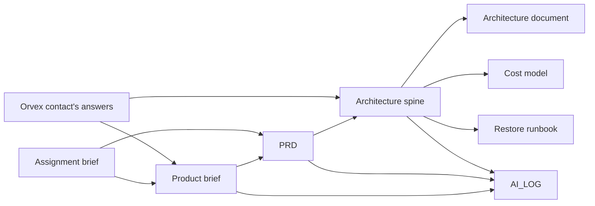
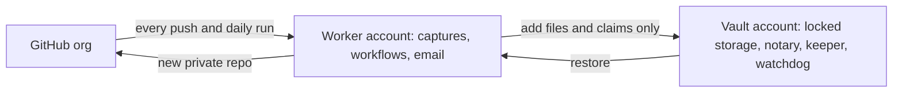

# Strata: daily GitHub org backup on AWS

Strata is the design for a daily, unattended backup of every repository in Orvex AI's GitHub org, kept in Orvex's own AWS account.

- **What it stores.** Only what changes, and nothing on a quiet day.
- **Rewritten history.** It keeps commits lost to force-pushes and deletions.
- **Restores.** It rebuilds any repository exactly as it was on any backed-up day, into a new private repository, even when GitHub is down.
- **Tamper resistance.** Nobody, including the person who runs it or an attacker with a stolen GitHub token or AWS credential, can delete or change existing backups.
- **No silent failures.** Every failure is loud.

This repository holds the design work, produced with Claude Code and the BMAD method. Nothing here is deployed code.

## Deliverables

| Deliverable | File | What it answers |
|---|---|---|
| **PRD** (produced with BMAD) | [`PRD.md`](PRD.md) | Requirements FR-1 to FR-67, non-functional and cost requirements, success metrics, non-goals |
| **Architecture document, with diagrams** | [`ARCHITECTURE.md`](ARCHITECTURE.md) | The design explained, answers to every question the assignment asks, trade-offs, failure modes, risks |
| **Cost model** | [`COST-MODEL.md`](COST-MODEL.md) + [`cost_model.py`](cost_model.py) | Monthly bill today and at 10× for four designs, every assumption stated, sensitivity |
| **Restore runbook** | [`RESTORE-RUNBOOK.md`](RESTORE-RUNBOOK.md) | Restoring one repository on one date, step by step, with timings and checks |
| **AI log** | [`AI_LOG.md`](AI_LOG.md) | How I used Claude and BMAD, every decision I made, and the times I overruled Claude |

This repository contains only the deliverables listed above. The working files behind them (the product brief, the architecture spine with the binding decisions AD-1 to AD-29, the BMAD decision logs, research and reviews) are not published; the documents refer to them by name. Each decision is explained in the architecture document's decision record (§4) and in AI_LOG.md.

## How the documents fit together

The **brief** sets the decisions on scope, roles and retention. The **PRD** turns them into testable requirements. The **spine** fixes the architecture decisions that keep separately built parts consistent. The **architecture document**, **cost model** and **runbook** explain, price and operate that design.

## The design in one picture

- **Capture.** Strata captures on every push and once a day, and stores only new Git objects: a full base, then small additions. A new base starts after 7 days with changes.
- **Running it.** The daily backup is one scheduled batch job on AWS Fargate that captures every repository, retries failures and, if the run still fails, alerts and runs once more. Every repository gets its daily capture, even if it was also captured after a push. Each push is captured on its own through a queue and AWS Lambda, with the same capture code. Restores, restore tests and live-event handling run as AWS Step Functions workflows, because they wait for hours or hold state.
- **Storage.** Backups sit in **S3 Glacier Deep Archive** once the vault has verified them, with small files in S3 Standard. All of it is locked with **S3 Object Lock in compliance mode**, which nobody can shorten, not even the AWS account's **root** user (the all-powerful owner login of an AWS account). While a repository's current backup chain is in use, its files also carry an **event hold**, an S3 setting that keeps them undeletable until Strata's vault releases it.
- **Two accounts.** The worker account does the work and can only *add* files and *claim* results (a **claim** is a statement the vault checks before recording it). The vault account checks every claim and alone changes locks, through the notary and keeper. Nothing automated can deploy to the vault.
- **Restores.** No approval is needed: an entitled person starts a restore by email and confirms it through a single-use link. A restore reads the vault's records, rebuilds the repository into a private copy in AWS, and then creates a new private GitHub repository. A restore typically takes 12–13 hours, inside the 24-hour target; the operator is alerted if one is still running at 14 hours, and a build gate requires the largest repository to restore within 18 hours.

## Roles, and why

| Role | Knows | Does | Cannot |
|---|---|---|---|
| Backup operator (for example a DevOps engineer) | How Strata, AWS and GitHub work | Keeps Strata running, investigates failures, runs restores, carries out approved extensions | Delete, change or weaken backups; request or approve extensions |
| Repo owner (the GitHub team assigned to the repo) | How important the code is | Investigates force-pushes and deletions; requests extensions | Approve its own request |
| Budget owner | Orvex's finances | Approves or denies extensions; receives the monthly cost email | Shorten any retention or lock |

Powers are split by knowledge, so no single person, or single stolen credential, can both decide and act on retention.

## Retention proposal

- **Routine snapshots: 1 year.** Long enough to investigate a bug found long after it was introduced, and above Deep Archive's 180-day minimum, so nothing is billed after deletion.
- **At-risk data** (commits lost to a force-push or deletion): **3 years**, and deleted only after a recorded decision. An unanswered warning keeps the data.
- **Cost of shortening:** routine data at 180 days would save only about $0.09 a month today ($0.70 at 10×). It would also shrink both the restore window and the tamper-protection window.

The storage classes and lifecycle rules, with their trade-offs, are in [`ARCHITECTURE.md` §2.5](ARCHITECTURE.md).

## Cost at a glance

| | Today (93 repos, ~4 GB) | At 10× |
|---|---|---|
| Chosen design (daily batch job, Step Functions for restores and events) | **~$9.60 a month** | **~$54.60 a month** (5.7×) |

- **Where the money goes:** storage is about $0.40 of that. The rest is capture compute and fixed security and monitoring items.
- **Biggest assumption:** pushes per day × seconds per capture.
- **At 10×:** an always-on Graviton VM becomes cheaper only if a capture takes longer than about 22 seconds, so it should be reconsidered at that scale using the capture time measured in the build.

Details are in [`COST-MODEL.md`](COST-MODEL.md).

## Scope of version 1

- **In:** every repository in the org, with all commits, branches and tags, Git LFS objects and wikis.
- **Out:** issues, pull requests, releases, repository settings, and Actions secrets and artifacts. Paging tools, a web UI and a second region are also out.

## Residual risks

The full list, with mitigations, is in [`ARCHITECTURE.md` §6.1](ARCHITECTURE.md#61-residual-risks). The main ones:

- **The management account's root user** can still remove the vault's protective policies or close the vault account. This is mitigated by hardware MFA held by two people, and by forwarding those events to the vault as security alerts.
- **Commits pushed and overwritten within minutes,** or announced by a webhook GitHub failed to deliver, may be lost. Every push is captured, and the result is always reported.
- **Restored repositories can be cloned** outside Orvex without detection.
- **Email is the only alert channel** in v1.
- **S3 Object Lock event holds** are a recent AWS feature (September 2026). If needed, the fallback is a daily lock extension.

## Open questions for Orvex

The canonical list, with what each answer changes, is in [`ARCHITECTURE.md` §6.3](ARCHITECTURE.md#63-open-questions-for-orvex).

1. **What base permission do members of the Orvex GitHub org have?** This blocks GitHub restores: anything above "No permission" lets every member read a restored private repository, so Strata's access check on the restored repository would fail.
2. Does Orvex use an AWS Organization? The vault account's protections depend on it.
3. Is the Orvex GitHub org on Enterprise Cloud with a verified domain? That's needed to read members' work emails; otherwise a mapping file is used.
4. Does Orvex have a data-residency requirement? The design uses eu-west-1 (Ireland), cheaper than eu-central-1, the only other EU region compared. It is configurable, for example to eu-west-2 (London).
5. Who holds each role: backup operator, second failure contact, budget owner?
6. Is fast recovery of rescued commits needed after an incident? v1 accepts up to 12 hours.
7. Which email clients does Orvex use, so the daily email can be tested on them?

## License

Orvex AI owns the intellectual property. You may publish the work in a public repo on your own GitHub under Apache 2.0, with the notice "Copyright 2026 Orvex AI".

Copyright 2026 Orvex AI

Licensed under the [Apache License, Version 2.0](LICENSE). This repository contains no secrets or credentials.
